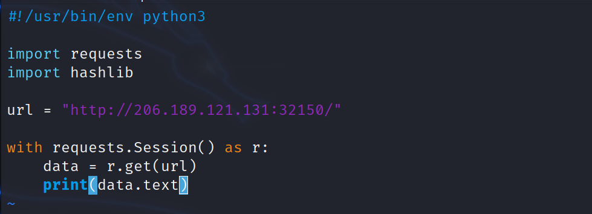
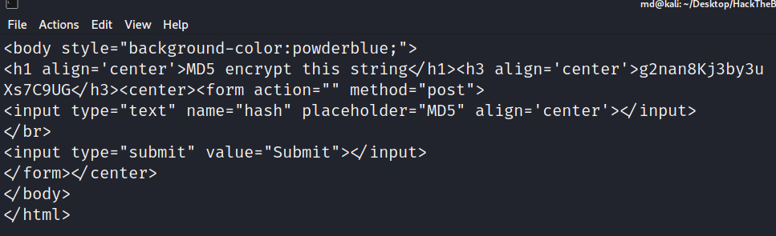
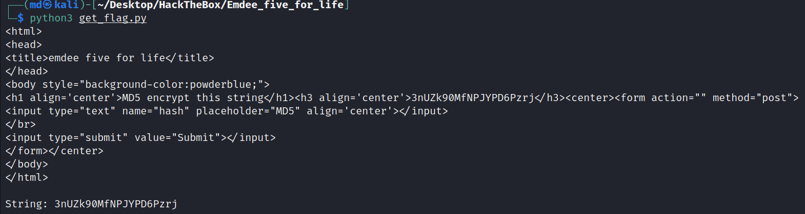
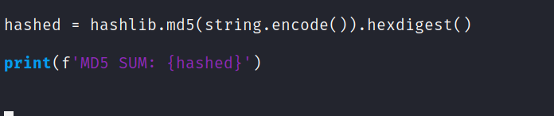
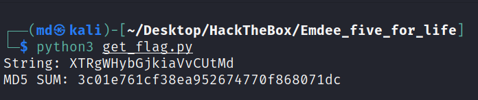
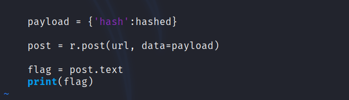
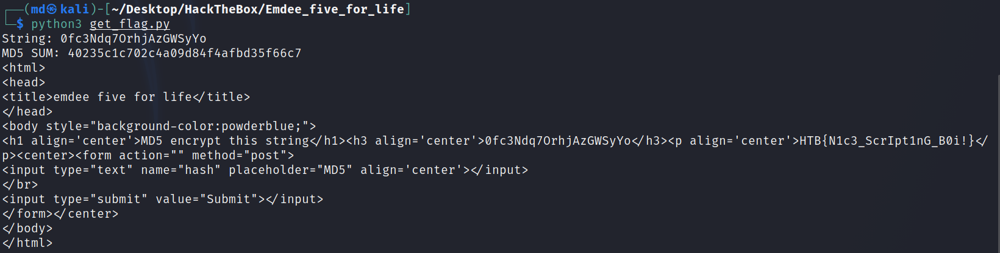
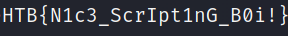

# Initial Recon
!(pix/1.png)

After visiting the webpage, it asks to enter the MD5 sum of the given string and submit it through the input field.

!(pix/11.png)

Using bash terminal I MD5 encrypt the string.
```
echo -n "<STRING>" | md5sum
```


After submitting the MD5 sum of the sting, it got "Too slow!" response, but now a different string. I tried a few more time and still get the same message. I have concluded that this needs to be automated.

# Python Script
To accomplish this, I will use python and its requests and hashlib libraries. 


Looking at the http request, it looks like the webpage is using cookie and the hash is passed as "hash="
This ensures that I need to use session.requests in python.

### Making the GET request





I can see the http request and, in it is the string that needs to be encrypted.

Next, I will isolate the string from the text. 


### Strip String




Since the given string is always the same length, I used 'index' to isolate the string from the text.


### MD5 Encrypt






Using hashlib, I encrypted the string into a variable. 
Now I have to take the encrypted string and make a HTTP POST request to get the flag.


### HTTP POST Request





Using r.post I am able to make a post request using the same session cookie. I made a POST request with my MD5 as the payload and get a response from the server with the flag. 


