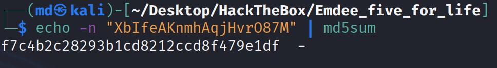
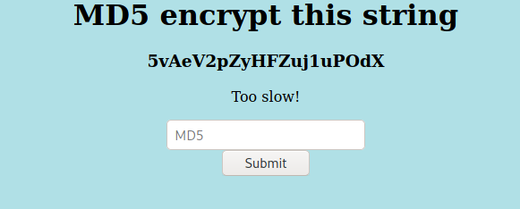
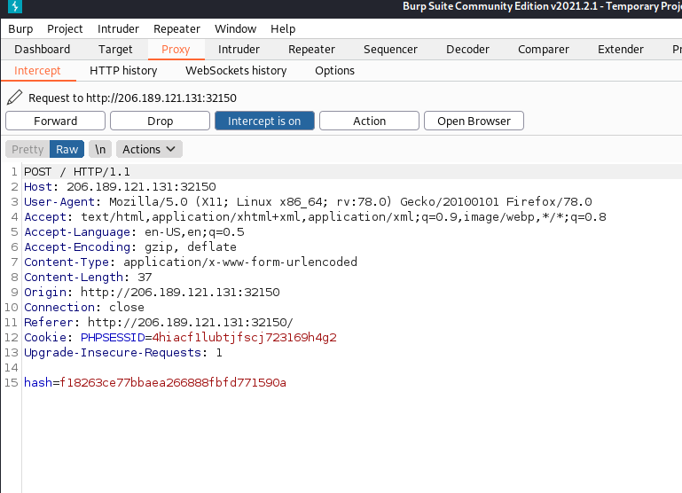

# Initial Recon


After visiting the webpage, it asks to enter the MD5 sum of the given string and submit it through the input field.



Using bash terminal I MD5 encrypt the string.
```
echo -n "<STRING>" | md5sum
```


After sumbitting the MD5 sum of the sting, it got "Too slow!" response, but now a differnt string. I tried a few more time and still get the same message. I have conncluded that this needs to be automated.

# Python Script
To accomplish this, I will use python and its requests and hashlib libraries. 


Looking at the http request, it looks like the webpage is using cookie and the hash is passed as "hash="
This ensures that I need to use session.requests in python.


