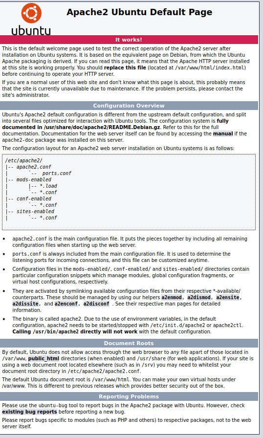

# LazyAdmin | Wite-Up

## Enumeration

- Run nmap scan to see what ports and services are running.
    ``` 
    nmap -sC -sV 10.10.163.194
    ```
    

- nmap shows port 22 and 80 open. SSH can't be brute forced so lets check out the website.

    
    - The webpage is the default apache page.


